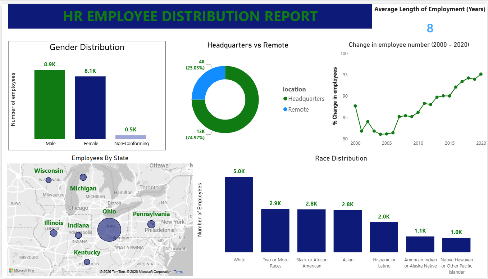
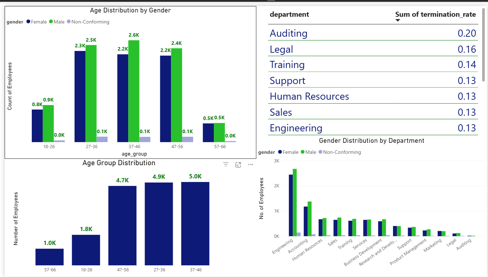

# HR Workforce Analytics (SQL & Power BI)

## Project Overview
This project analyzes HR employee data from the year 2000 to 2020. I analyzed data for a financial services organization to better understand workforce composition, retention patterns, and long-term organizational trends. This dataset had over 30000 rows and I used SQL for data cleaning and metric calculations, and Power BI for interactive visualization. The dashboards are designed to support HR and leadership decision-making in a people-first, service-oriented environment.

## Dashboards
### Workforce Overview

### Workforce Trends & Attrition

## Key Questions Addressed
- What does the workforce look like today?
- How is the workforce distributed across departments, age groups, and locations?
- Where are retention risks across the organization?
- Which departments experience higher employee turnover?
- How stable is the organization over time?
- Are there potential continuity or succession risks?
  
---

## Key Findings

- The workforce is largely mid-career, with employee ages ranging from 20 to 57, and the highest concentration in the 25–44 age range and an average tenure of 8 years indicating strong overall retention.
- Gender representation across departments is relatively balanced, though there are slightly more male employees overall.
- White employees represent the largest racial group, while Native Hawaiian and American Indian employees are the least represented.
- Most employees are headquarters-based, with a smaller portion working remotely, and a significant share of the workforce is located in Ohio.
- Average tenure across departments is approximately 8 years, indicating strong employee retention and organizational stability.
- The Marketing and Training departments experience higher turnover, while Research and Development, Support, and Legal show lower turnover and greater stability.
- Despite differences in departmental attrition, overall employee headcount has increased steadily over time, reflecting long-term growth.
- Attrition is higher in the Auditing and Legal departments compared to others.
- Employee headcount has increased steadily over the past two decades.

---

## Recommendations
- Take a closer look at departments with higher attrition to understand why employees are leaving and address issues before they impact the business.
- Begin succession planning for mid-career-heavy teams, since higher turnover in Auditing and Legal could leave key roles without backup and create continuity risks.
- Consider expanding flexible or remote work options where possible to improve retention and attract a wider range of talent, especially for roles that don’t require being fully on-site.
 
---

## Tools Used
- **SQL** – data cleaning, standardization, and calculation of metrics calculation.
- **Power BI** – data modeling and visualisation.

---

## SQL Workflow
SQL was used to clean and standardize the raw data and calculate key metrics prior to visualization in Power BI.  
Key SQL tasks included:
- Standardizing date formats
- Handling missing and inconsistent values
- Calculating average tenure
- Calculating attrition rates by department

SQL files can be found in the [`sql/`](sql/) folder.

### Data Cleaning Notes

During data preparation, some records required cleanup to ensure accurate analysis. A small number of employees had invalid age values (negative ages), so only employees aged **18 and above** were included in the final dataset, resulting in the removal of **1247 records**. Additionally, several termination dates extended far into the futur so to keep the analysis realistic, only termination dates up to the current date were considered, which led to the exclusion of **2869 records**.

---

## Presentation
A summary of key insights and recommendations is available as a presentation:
- [`HR_Workforce_Insights.pdf`](reports/HR_Workforce_Insights.pdf)
